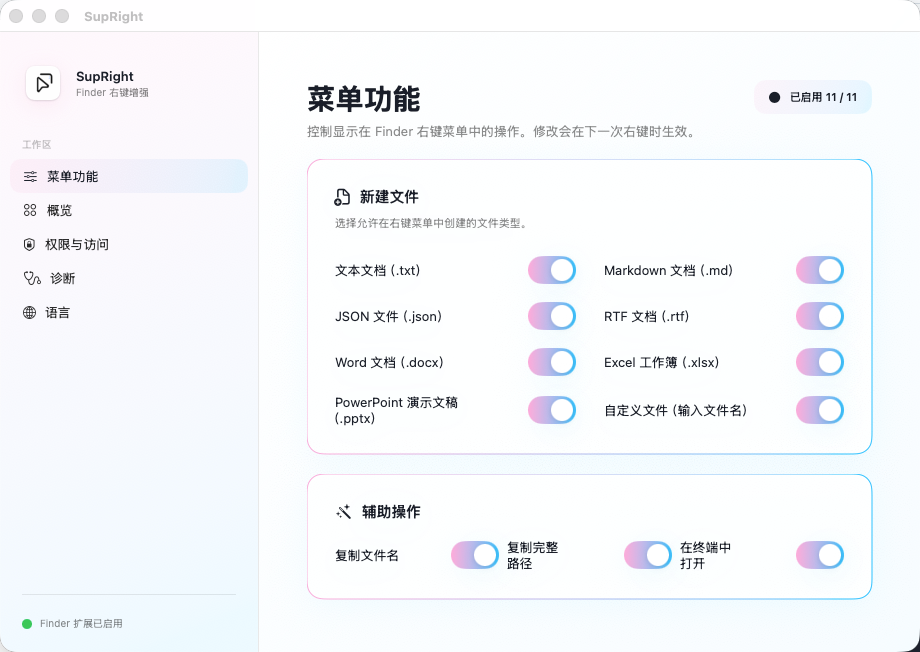

# SupRight

SupRight 是一个开源的 macOS Finder 右键菜单增强工具：在当前目录快速新建常用文件、复制文件信息和打开 Terminal。

> 当前版本：`v0.2.1`（开发证书签名、未公证测试版）



## 下载测试包

- [下载 SupRight v0.2.1（macOS ZIP）](https://github.com/scend63167/SupRight/releases/download/v0.2.1/SupRight-v0.2.1-macos-development-signed.zip)
- [下载 SHA-256 校验文件](https://github.com/scend63167/SupRight/releases/download/v0.2.1/SupRight-v0.2.1-macos-development-signed.zip.sha256)
- [查看 v0.2.1 发布说明](https://github.com/scend63167/SupRight/releases/tag/v0.2.1)

## 功能

- 在所有 Finder 目录显示 `SupRight` 右键子菜单
- 新建 TXT、Markdown、JSON、RTF、Word、Excel、PowerPoint 文件
- 新建“自定义文件”：直接输入完整名称，例如 `Untitled.py` 或 `config.yaml`
- 自动避免重名，绝不覆盖现有文件
- 复制文件名、复制完整路径、在当前目录打开 Terminal
- 在应用内开关每个菜单功能
- 可选“登录时后台启动”，并在关闭设置窗口后继续驻留菜单栏、不显示 Dock 图标
- 支持简体中文与英文

## 系统要求

- macOS 26.5 或更高版本
- 完全磁盘访问（用于桌面、文稿、下载等受保护目录的写入）

## 安装测试版

1. [下载 `SupRight-v0.2.1-macos-development-signed.zip`](https://github.com/scend63167/SupRight/releases/download/v0.2.1/SupRight-v0.2.1-macos-development-signed.zip) 并解压。
2. 将 `SupRight.app` 拖到“应用程序”文件夹。
3. 首次打开若被 macOS 拦截：前往“系统设置 → 隐私与安全性”，选择“仍要打开”。
4. 在“系统设置 → 隐私与安全性 → 完全磁盘访问”中开启 SupRight。
5. 打开 Finder，在任意目录空白处右键，选择 `SupRight`。

如需登录后自动驻留菜单栏，请打开 SupRight 的“概览”，开启“登录时后台启动”。

这是使用 Apple Development 证书签名、但未公证的测试包。请仅从本项目的 GitHub Release 下载；未来正式版本会采用 Developer ID 签名和 Apple 公证。

### 首次打开：手动绕过 macOS 安全提示

首次打开时，macOS 可能提示无法验证开发者或阻止应用打开。按以下任一方式处理：

1. 在“应用程序”文件夹中按住 `Control` 点击 `SupRight.app`，选择“打开”，然后在确认窗口再次选择“打开”。
2. 如果仍被拦截，打开“系统设置 → 隐私与安全性”，滚动到安全性提示，点击“仍要打开”，再确认一次。

完成后请重新打开 SupRight；不要使用终端命令移除安全属性，也不要安装来源不明的同名 App。

## 从源码运行

1. 安装 Xcode 17 或更新版本。
2. 克隆仓库，打开 `SupRight.xcodeproj`。
3. 选择 `SupRight` Scheme 与“我的 Mac”，在 Signing & Capabilities 中选择你自己的开发团队。
4. 运行应用，并按上方步骤授予完全磁盘访问。

如果 Xcode 报 Bundle Identifier 或 App Group 冲突，请按[本地开发与签名说明](docs/DEVELOPMENT.md)改为自己的标识。

## 打包

执行：

```zsh
SIGNING_IDENTITY='Apple Development: your-name (TEAMID)' ./Scripts/package-beta.sh
```

脚本会在 `dist/` 生成开发证书签名的测试包 ZIP 及 SHA-256 校验文件。详情见 [发布说明](docs/RELEASING.md)。

## 隐私与权限

SupRight 不收集、上传或同步你的文件内容、文件路径、使用行为或身份数据。

Finder 扩展仅在你打开右键菜单或执行菜单操作时处理当前目录和所选项目。完全磁盘访问只用于你明确发起的文件创建等操作；只读目录、SIP 保护位置和网络卷仍可能拒绝操作。

## 贡献与反馈

- 使用 [Issues](../../issues) 报告问题或提出功能建议。
- 提交代码前请阅读 [CONTRIBUTING.md](CONTRIBUTING.md)。
- 项目采用 [MIT License](LICENSE)，更新内容见 [CHANGELOG.md](CHANGELOG.md)。
