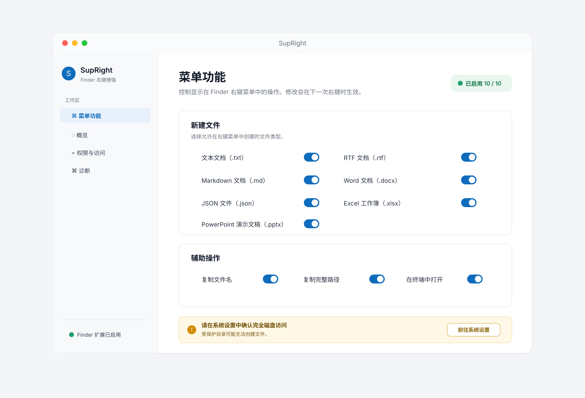

# SupRight 配置页设计稿

> 状态：待评审
> 对应：[MVP_PRD](MVP_PRD.md)、[MVP_UI_SPEC](MVP_UI_SPEC.md)、[MVP_TECHNICAL_DESIGN](MVP_TECHNICAL_DESIGN.md)

## 设计意图

- 参考 Codex 的信息层级：左侧导航只负责定位，右侧工作区负责一个明确任务。
- 当前功能不多，但侧边栏提供“概览 / 菜单功能 / 权限与访问 / 诊断 / 语言”五个稳定入口，未来增加模板、常用目录或外部 App 时不会推翻布局。
- 顶部只表达整体状态；具体开关集中在“菜单功能”页，权限风险集中在“权限与访问”页。
- 完全磁盘访问按钮的文案是“前往系统设置”，不暗示或承诺自动授权。
- 视觉基调采用 `#ffacda` 粉色与 `#0ec1ff` 蓝色的柔和渐变：用于侧边栏选中态、状态标签、卡片描边和开关；内容卡保持白底，避免影响可读性。
- 左上角展示 SupRight 的白底极简箭头 Logo；不再使用字母占位符。

## 页面与行为

| 页面 | 目的 | MVP 行为 |
| --- | --- | --- |
| 概览 | 一眼看清是否可用 | 显示启用功能数、Finder 扩展状态、完全磁盘访问引导 |
| 菜单功能 | 管理每个右键菜单项 | 十个开关，修改后下次 Finder 右键立即生效 |
| 权限与访问 | 解释全目录模式的边界 | 引导到系统设置；说明由主 App 在完全磁盘访问下执行写入，受保护或只读位置仍可能失败 |
| 诊断 | 降低排错成本 | 显示扩展启用状态、最近一次配置更新时间和基础排错指引 |
| 语言 | 切换显示语言 | 支持跟随系统、简体中文与 English；下一次 Finder 右键同步更新 |

## 系统限制

“完全磁盘访问”只能由用户本人在系统设置中开启。按钮只能打开设置入口，不能自动勾选、不能绕过确认，也不能保证系统保护目录一定可写。依据：[Apple 沙盒文件访问文档](https://developer.apple.com/documentation/security/accessing-files-from-the-macos-app-sandbox)。
